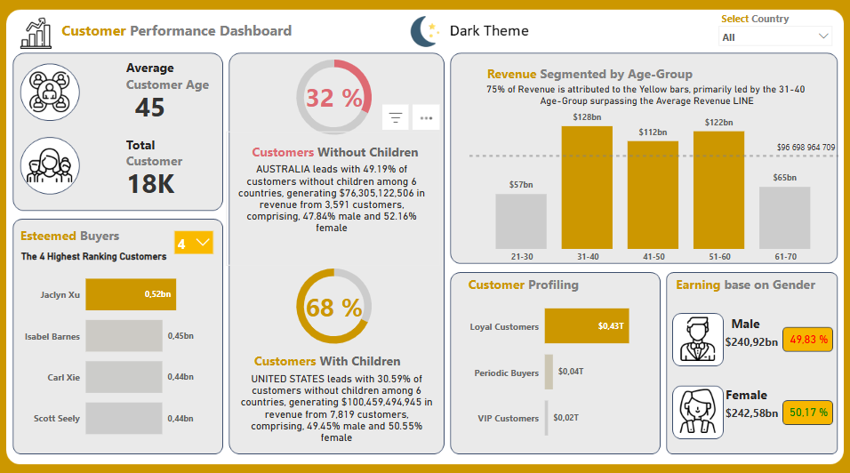
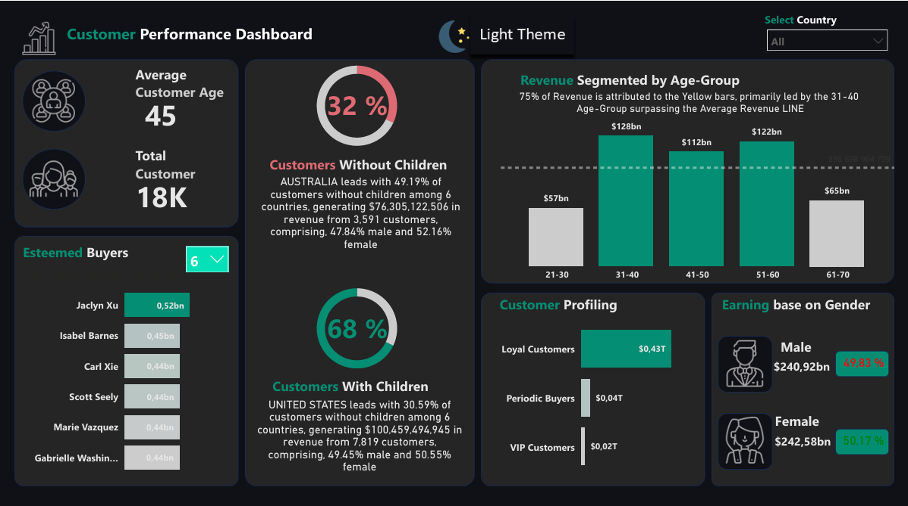

# 📊 Customer Insights Dashboard

An interactive Power BI dashboard designed to explore customer behavior, segmentation, and revenue trends. This dashboard provides strategic insights into customer profiles, preferences, and purchasing patterns. It's equipped with dynamic filters and intuitive visualizations to assist data-driven marketing and decision-making.

## 🚀 Project Overview

This project delivers an interactive dashboard powered by Power BI, which focuses on customer segmentation, revenue trends, and behavioral insights. The dashboard is built with dynamic filters, enabling businesses to slice and dice data by different dimensions such as gender, family status, and more.

### Key Features:
- **Customer Segmentation**: Classify customers into VIP, Loyal, and Periodic groups.
- **Behavioral Insights**: Analyze customer preferences and buying patterns.
- **Revenue Analysis**: Track revenue trends by gender, age, and family status.
- **Smart KPIs**: Monitor business performance through interactive and clear visual KPIs.

## 🛠️ Technologies Used

- **Power BI**: Interactive dashboard creation
- **DAX**: For data modeling and creating calculated columns/measures
- **Excel**: Data preparation and transformation
- **PowerPoint**: Used for presenting insights to stakeholders
